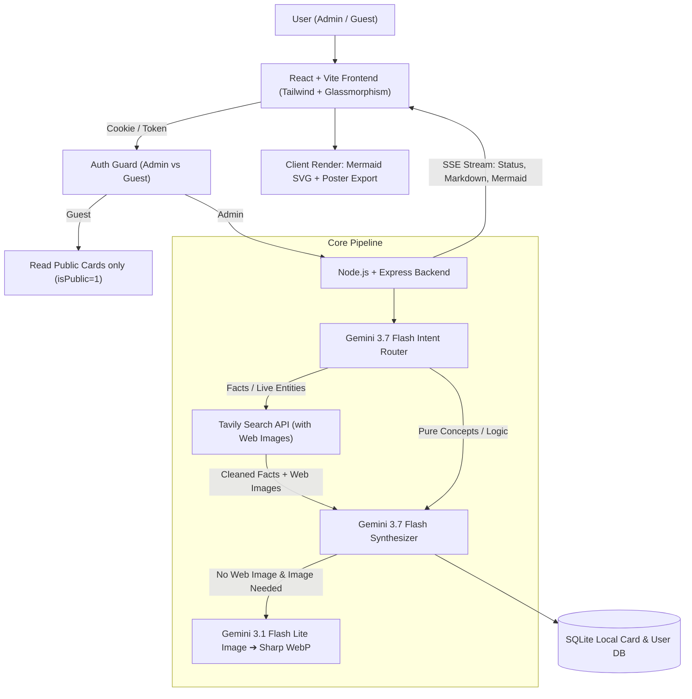

# SnapCard · Visual Knowledge Cards 🎴

> **Lightweight, ultra-fast visual knowledge card generator & archive web application.**  
> Powered by **Google Gemini 3.7 Flash** (via OpenRouter) + **Tavily Web Search** + **Gemini 3.1 Flash Lite Concept Illustration** + **Client-side Mermaid Diagrams** + **SQLite Storage & RBAC Auth**.

**English** | [简体中文](README.zh-CN.md)

[](https://opensource.org/licenses/MIT)
[](https://nodejs.org)
[](https://vitejs.dev)
[](https://react.dev)

---

## ✨ Key Features

1. **⚡ Ultra-Responsive Client Performance**
   - Real-time Server-Sent Events (SSE) progress streaming (Intent Routing ➔ Search/Reasoning ➔ Visual Illustration ➔ Layout Synthesis).
   - Client-side dynamic vector Mermaid.js SVG chart and Markdown rendering with zero extra server-side layout load.
2. **🧠 Smart Intent Routing & Branch Decision**
   - **Branch A (Live Facts / Entity Queries)**: Automatically queries Tavily Search API with `include_images=true` for cleaned real-world facts and candidate high-res web photos.
   - **Branch B (Concepts / Logic / First-Principles)**: Bypasses web search for instant Gemini 3.7 Flash deep reasoning.
3. **🎨 Visual Illustration & WebP Caching**
   - Prioritizes authentic matching web images; when unavailable, generates minimalist concept illustrations via `google/gemini-3.1-flash-lite-image` and converts to lightweight WebP locally.
   - Multimodal photo capture/upload: user photo is used as the card header while extracting visual knowledge.
4. **🎯 3 Intuitive Audience Explanation Tiers**
   - 🧸 **Explain to a Child** (讲给小孩): Playful stories, everyday analogies, zero jargon.
   - ☕ **In Plain Words** (说点人话): Straightforward, essence-driven, crystal clear takeaways.
   - 🎓 **Masterclass** (导师开课): Rigorous academic derivations, architecture, deep mechanisms.
5. **🔐 Authentication & Role-Based Access Control (RBAC)**
   - **Admin**: Username/password sign-in with long-lived session cookies (Default: 30 days, configurable to 7d / 30d / 90d / 1yr). Unlocks card generation, follow-up Q&A, photo recognition, deletion, settings, and **Public Visibility controls**.
   - **Guest**: Read-only access to cards explicitly marked as Public by Admin. Generation and modifications are restricted.
   - **One-click Public/Private Toggle**: Admin can toggle any card to "Public to Guests" or "Private" right on top of the card.
6. **💬 In-Card Context-Scoped Follow-Up Q&A**
   - Single-card temporary conversation without heavy global history bloat.
7. **🖼️ One-Click Social Poster Export**
   - Export high-resolution (2.5x supersampled) social share knowledge card posters in PNG format (Instagram / Xiaohongshu / Twitter aesthetic style).
8. **🌐 Bilingual & Smart Language Matching**
   - One-click English/Chinese interface toggle; model generation language strictly matches user query language.
9. **💾 Ultra-Lightweight Server Footprint**
   - Self-contained SQLite database (`better-sqlite3`) with WAL mode. Zero complex external database maintenance.

---

## 🏗️ System Architecture



---

## 🐧 Linux Production Deployment (24/7 Long-Term Running)

### Option A: Robust One-Click Linux Deploy Script (Recommended)

On any Linux server (Ubuntu, Debian, CentOS, Rocky Linux, RHEL, Arch), simply execute:

```bash
# Make executable and run
chmod +x deploy.sh
./deploy.sh
```

**What the script does automatically:**
1. Verifies system environment; installs **Node.js 22.x LTS** if missing or outdated.
2. Checks `.env` configuration and initializes `./data` and `./uploads` persistence directories.
3. Installs dependencies and builds the production frontend (`npm run build`).
4. Configures and starts **PM2 Daemon Process** (auto-restarts on crashes, auto-heals memory leaks, auto-starts on boot).
5. Performs HTTP health check and displays public IP access address and management commands.

#### Common PM2 Management Commands:
```bash
pm2 status               # Check running status
pm2 logs snapcard        # View live logs
pm2 restart snapcard     # Restart application
pm2 stop snapcard        # Stop application
pm2 startup              # Enable auto-start on system reboot
```

---

### Option B: Docker / Docker Compose Deployment

```bash
# Build and start container in detached mode
docker compose up -d --build
```
*Data (`./data`) and generated images (`./uploads`) are automatically persisted in host volumes.*

---

### Option C: Nginx Reverse Proxy (Domain & SSL)

If you are using Nginx as a reverse proxy, refer to `nginx.conf.example`:
> **Crucial Note**: Because knowledge card generation uses Server-Sent Events (SSE), you MUST configure `proxy_buffering off;` to prevent Nginx from buffering and delaying the live streaming text/progress.

---

## 💻 Local Development & Debugging

### 1. Install Dependencies
```bash
npm install
```

### 2. Configure Environment (`.env`)
```env
PORT=3001
OPENROUTER_API_KEY=sk-or-v1-...
TAVILY_API_KEY=tvly-...
OPENROUTER_MODEL=google/gemini-3.7-flash
OPENROUTER_IMAGE_MODEL=google/gemini-3.1-flash-lite-image
```

### 3. Start Development Server
```bash
npm run dev
```
- Frontend UI: `http://localhost:5173`
- Backend API: `http://localhost:3001`
- Default Admin Credentials: `admin` / `admin123`

---

## 📄 License
[MIT License](LICENSE)
