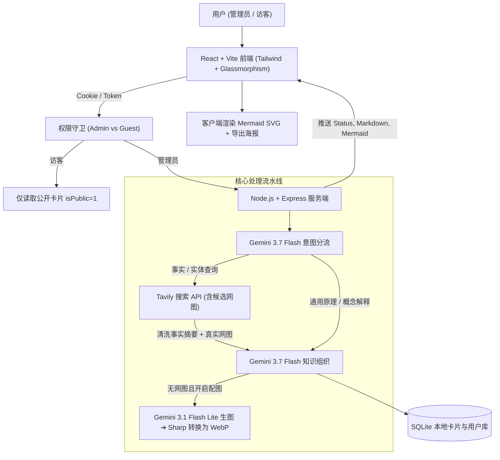

# SnapCard · 随手查图文知识卡片 🎴

> **轻量、极速、高响应的“随手查·图文知识卡片” Web 应用**  
> 基于 **Google Gemini 3.7 Flash** (通过 OpenRouter) + **Tavily 联网搜索** + **Gemini 3.1 Flash Lite 视觉生图** + **Mermaid 结构图** + **SQLite 极简归档与权限控制**。

[English](README.md) | **简体中文**

[](https://opensource.org/licenses/MIT)
[](https://nodejs.org)
[](https://vitejs.dev)
[](https://react.dev)

---

## ✨ 核心特性

1. **⚡ 极致客户端响应速度**
   - SSE (Server-Sent Events) 实时流水线进度推送（意图分流 ➔ 联网检索 ➔ 概念插图 ➔ 知识排版）。
   - 客户端动态渲染 Mermaid.js SVG 图表与 Markdown，服务端零额外排版负担。
2. **🧠 智能意图路由与分支决策**
   - **分支 A（事实/实体查询）**：自动触发 Tavily 搜索，聚合全网清洗后的事实与真实高清网图。
   - **分支 B（原理/常识/逻辑）**：跳过搜索，直接由 Gemini 3.7 Flash 深度推理与提炼。
3. **🎨 智能配图与 WebP 本地归档**
   - 优先选用 Tavily 真实匹配网图；无网图时通过视觉 Prompt 调用 `google/gemini-3.1-flash-lite-image` 生成高质量概念图并压缩为轻量 WebP 存储。
   - 支持拍照/传图识图，用户图片自动作为卡片首图并触发多模态知识解析。
4. **🎯 三档通俗有趣的解释风格**
   - 🧸 **讲给小孩** (Explain to a Child)：童趣故事、生动比喻、零门槛大白话。
   - ☕ **说点人话** (In Plain Words)：不装不绕、讲透本质、直击核心用处与金句。
   - 🎓 **导师开课** (Masterclass)：学术推导、底层架构、严谨深度拆解。
5. **🔐 登录与访客权限控制 (RBAC)**
   - **管理员 (Admin)**：账号登录，支持长效 Session / Cookie（默认 30 天，可自定义 7天/30天/90天/1年），拥有卡片生成、拍照识图、追问、删除、API 配置及**公开权限管理**。
   - **访客 (Guest)**：免登录，仅可浏览管理员公开分享的卡片，禁止生成与修改。
   - **一键公开/私密**：管理员在每张卡片顶部可一键切换「公开给访客」或「仅管理员私密」。
6. **💬 单卡片轻量级追问机制**
   - 管理员在卡片下发起深入追问时，仅携带当前卡片作为上下文，无沉重全局历史会话包袱。
7. **🖼️ 一键生成社交高清海报**
   - 一键将卡片导出为小红书/推特风格的 2.5x 超采样高清知识海报（PNG 格式）。
8. **🌐 国际化与智能语言匹配**
   - 界面中英文自由切换；模型输出语言严格跟随用户提问语言。
9. **💾 极轻服务端架构**
   - 仅依赖轻量 SQLite (`better-sqlite3`) 存储卡片与用户元数据，零复杂运维。

---

## 🏗️ 架构设计



---

## 🐧 Linux 生产环境部署 (长期运行)

### 方案 A：Linux 一键鲁棒部署脚本 (推荐)

在 Linux 服务器（Ubuntu / Debian / CentOS / Rocky / Arch）上直接运行一键部署脚本：

```bash
# 赋予执行权限并运行
chmod +x deploy.sh
./deploy.sh
```

**脚本自动完成以下工作：**
1. 自动检测系统环境，缺少 Node.js 时自动安装 Node.js 22.x LTS；
2. 自动检查 `.env` 配置；
3. 安装依赖并自动执行 `npm run build` 打包前端；
4. 自动配置与启动 **PM2 守护进程**（崩溃自动拉起、内存超限自愈、开机自启）；
5. 执行接口健康检查并输出公网访问地址与运维命令。

#### 常用 PM2 运维命令：
```bash
pm2 status               # 查看运行状态
pm2 logs snapcard        # 查看实时日志
pm2 restart snapcard     # 重启服务
pm2 stop snapcard        # 停止服务
pm2 startup              # 配置开机自启
```

---

### 方案 B：Docker / Docker Compose 部署

```bash
# 启动容器化服务
docker compose up -d --build
```
数据与生成图片会自动持久化在宿主机的 `./data` 与 `./uploads` 卷中。

---

### 方案 C：Nginx 反向代理配置

若需绑定域名或配置 SSL 证书，参考项目根目录的 `nginx.conf.example`：
> **关键注意**：由于卡片生成采用 SSE 流式推送，Nginx 必须配置 `proxy_buffering off;`，防止数据流被 Nginx 缓存阻塞。

---

## 💻 本地开发与调试

### 1. 安装依赖
```bash
npm install
```

### 2. 配置环境变量 `.env`
```env
PORT=3001
OPENROUTER_API_KEY=sk-or-v1-...
TAVILY_API_KEY=tvly-...
OPENROUTER_MODEL=google/gemini-3.7-flash
OPENROUTER_IMAGE_MODEL=google/gemini-3.1-flash-lite-image
```

### 3. 启动开发服务器
```bash
npm run dev
```
- 前端地址：`http://localhost:5173`
- 后端服务：`http://localhost:3001`
- 默认管理员账号：`admin` / `admin123`

---

## 📄 开源协议
[MIT License](LICENSE)
